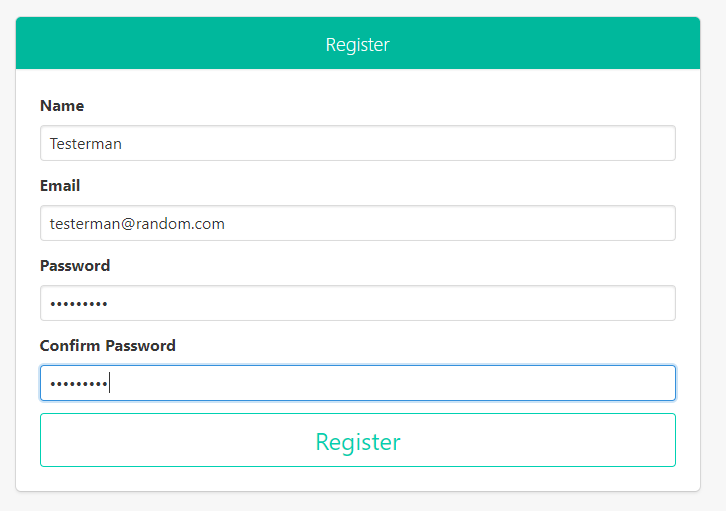
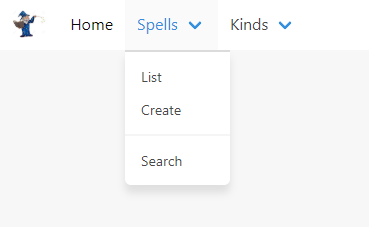
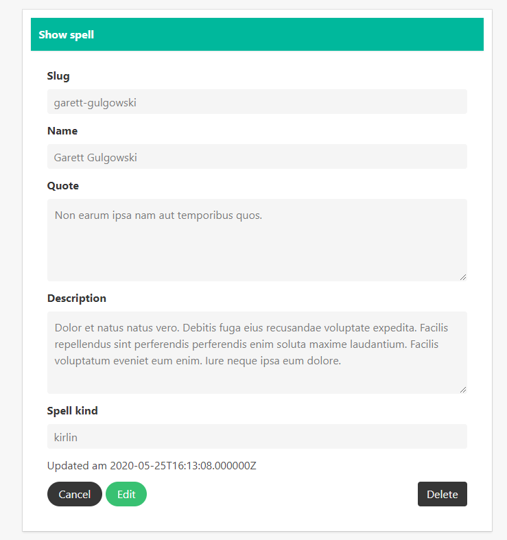
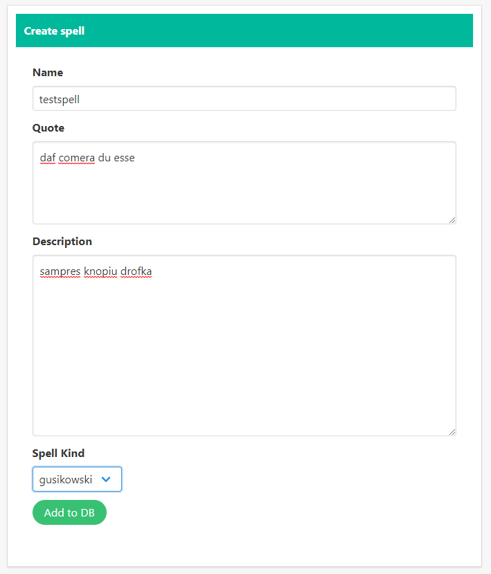
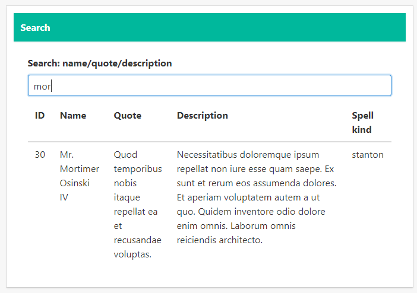
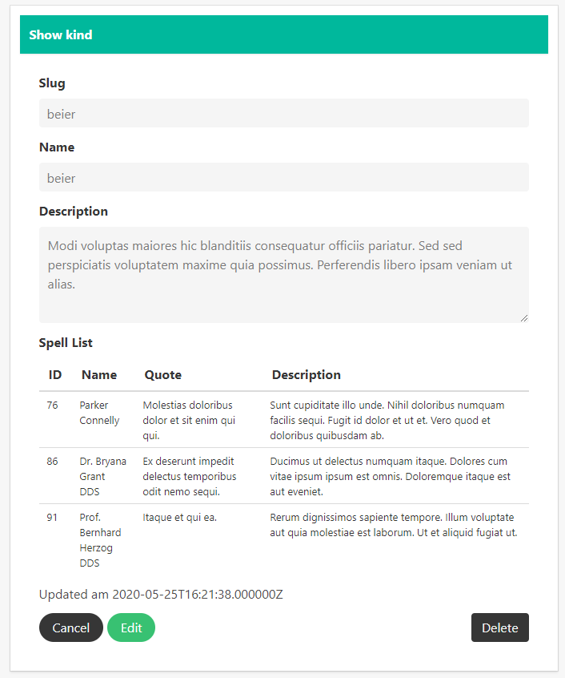
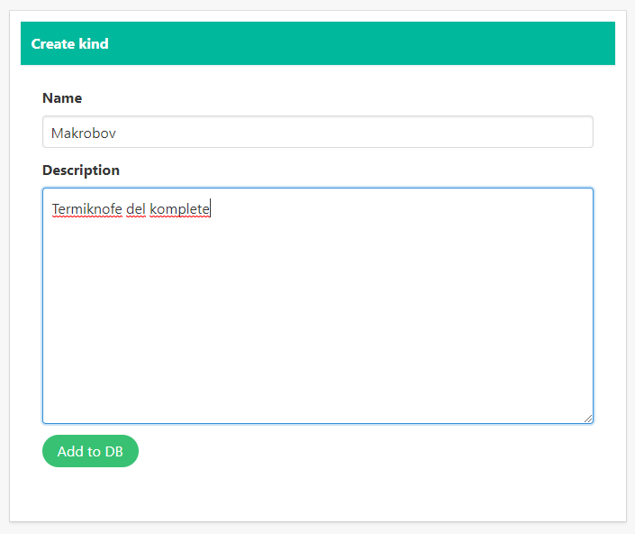

# BIC4MagicAlmanac
### Authors
- Rick Gerhardl ic18b082@technikum-wien.at
- Andreas Hinterberger ic18b008@technikum-wien.at
- Michael Kranl ic18b033@technikum-wien.at                   
- Josef Ramsauer ic18b003@technikum-wien.at

### Definition
Magic Almanac is a practical project of the course "Information Engineering" in 4BIC. In this course the aim was to consolidate our skills with JavaScript, espically in VueJS. In Magic Almanac our professor gave us a project where the backend was already deployed, we had to write the front-end to list, create and delete certain magic spells and their kinds. The front-end was mainly created with VueJS and Bulma, which where also the requirements in that project

### Support
Magic Almanac was tested under following browser:
 - Google Chrome v83.0.4103.106
 - Mozilla Firefox v76.0
 - Micrsoft Edge v79

### Registration and Login
When accessing the website a login mask get displayed. When you do not have registered yet, click on register and typ in your credentials. This credentials will be saved in your local lightDB database.


If you have rigistered on the application, you need to enter your credentials in the, when clicking on login on the top right of the browser. When you have entered your credentials right the application will welcome you.



### Options an the Webside
On the main side you have the three catigories "Home", "Spells" and "Kinds". When you click on "Home" you will come to the Welcome side as you just logged successful in.
#### Spells
Under "Spells" you have three different options, you can:
 - List all Spells that are currently in the database 
 - Create new Spells which get added to the database
 - Search for Spells after letters or words

(The ID of the spells will automiticaly get choosen by the system)



##### List Spells
When you list spells you will get all spells displayed which are currently in the database. By double-clicking on one spell, this particual spell gets shown. In this view you have the possibilty to Edit or Delete this sertain spell by the buttons at the end of the browser.
By editing the spells, please notice that all felds need to have filled out - instead you will get an error message.



##### Create Spells
In this view you have the option to create new spells which get stored in the database. Also here all felds need to be filled out. 



##### Search Spells
In the search view you have a box where you can input the word or the characters you are searching for. The given string will get searched in the sectors name, quote and description of the whole entry of the database and will automaticely will get displayed, if there is a match



#### Kinds
Under “Kinds” you have two different options, you can:

- List all Kinds that are currently in the database
- Create new Kinds which get added to the database

##### List Kinds
List Kinds works under the same principle as in Spells. When you are clicking on it, all the Kinds in the database will get displayed. By double-clicking on it you are also able to edit or delete an certain Kind. Additionaly when choosing an Kind you will see all the Spells which are under that specific Kind.



##### Create Kind
Here you are able to create an new Kind, under the same principle as in Spells. When you have added an new Kind you can link spells to it under the Spells section by using your created Kind. Also here are filds must be filled out, instead you will get an error message.




## Instruction 
This is the original instruction given from the professor:

# BIC4 Project: Magic almanac

## The magic almanac

This software lists magic spells and kinds belongs to them.
It is possible to search for spells by various parameters.

## Exercise

### Already providing

All routes that are needed are implemented:
 * **GET** ```/spell``` &rarr; Lists all spells
 * **GET** ```/list/spell``` &rarr; Returns JSON of all spells
 * **GET** ```/list/kind``` &rarr; Returns JSON of all kinds
 * **POST** ```/spell``` &rarr; Stores new spells
 * **GET** ```/spell/{slug}``` &rarr; Show spell
 * **PUT** ```/spell/{slug}``` &rarr; Update spell
 * **DELETE** ```/spell/{slug}``` &rarr; Delete spell
 * **GET** ```/spell/{slug}/edit``` &rarr; Edit spell
 * **GET** ```/search/spell``` &rarr; Search spells
 * **POST** ```/search/spell``` &rarr; Query spells
 * **GET** ```/kind``` &rarr; Lists all kinds
 * **GET** ```/list/kind``` &rarr; Returns JSON of all kinds
 * **POST** ```/kind``` &rarr; Stores new kinds
 * **GET** ```/kind/{slug}``` &rarr; Show kind
 * **PUT** ```/kind/{slug}``` &rarr; Update kind
 * **DELETE** ```/kind/{slug}``` &rarr; Delete kind
 * **GET** ```/kind/{slug}/edit``` &rarr; Edit kind

All views can be found in ```/resources/views```.

### TODO

#### VueJS

Implement your [VueJS](https://vuejs.org) components in the folder ```/resources/views/js/components```.
Register your components in ```/resources/views/js/app.js``` and use them in the following files:

 * ```/resources/views/kind```
     * ```/resources/views/kind/create.blade.php```
     * ```/resources/views/kind/edit.blade.php```
     * ```/resources/views/kind/index.blade.php```
     * ```/resources/views/kind/show.blade.php```
 * ```/resources/views/spell```
      * ```/resources/views/spell/create.blade.php```
      * ```/resources/views/spell/edit.blade.php```
      * ```/resources/views/spell/index.blade.php```
      * ```/resources/views/spell/search.blade.php```
      * ```/resources/views/spell/show.blade.php```
      
To query data for dropdowns in forms or to reload lists use the list routes:
 * **GET** ```/list/spell```
 * **GET** ```/list/kind```
 
For the search form use ```q``` as the name for the text input.
The search will be handled by the backend.

#### CSS (SCSS)

The design of the software need to be adapted.
[Bulma](https://bulma.io) is used to layout and style the website.
If wanted default styles can be overwritten by setting variables in the ```/resources/sass/_variables.scss``` file.
Also it is possible to write custom styles in ```/resources/sass/_custom.scss```.

A new logo need to be set. If pictures will be present on the website place them in ```/public/img``` folder.
Here you will also find the logo.

### Hints

#### JavaScript and CSS (SCSS)

To compile scss and JavaScript ```npm run dev``` need to be executed in the project folder.
It is also possible to run ```npm run watch``` so it is not need to execute ```npm run dev``` every time a change happend. 

#### Data for Database

To make starting developing fast there are some seeders implemented to fill all needed tables except the user table.
To populate the database run the command ```php artisan db:seed``` in the terminal in project root folder.

